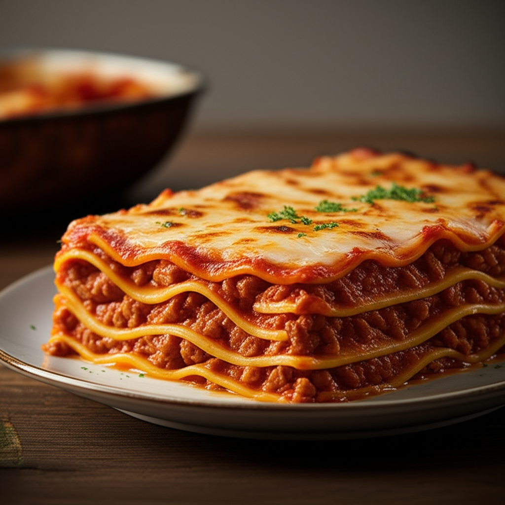

# PromptChef: tu chef personal en la nube
**Del algoritmo a tu mesa**  
Autor: Erika Tapia  
Curso: Generación de Prompts (Comisión 84185)

---

## Presentación del problema

**Lunes, 21:04.**  
Volvés a casa después de un día eterno. Estás cansado, tenés hambre… y la heladera te mira vacía, con medio limón, dos huevos y una duda existencial: **¿QUÉ COMEMOS HOY?**

Querés cocinar algo y arrancás buscando “receta fácil con lo que tengo”. Pero te metés en un mar de pestañas: blogs con historias eternas, videos larguísimos, y recetas que te piden justo lo que no tenés. Después de todo eso, terminás con arroz con atún. Otra vez. O directamente pedís por app.

En un mundo donde todo se automatiza, ¿cómo puede ser que todavía tengamos que pensar qué cocinar?

Ahí entra **PromptChef**, tu chef personal impulsado por inteligencia artificial. Una herramienta pensada para convertir sobras en platos dignos de restaurante. Usás lo que tenés, decís lo que querés, y en segundos recibís una receta única, sin bajar apps, sin pensar, sin frustrarse.

---

## Propuesta de solución

**PromptChef** es un asistente de cocina potenciado por inteligencia artificial que transforma ingredientes sueltos o ideas sueltas en recetas sabrosas, realistas y personalizadas.

La dinámica es simple:  
- Si tenés ingredientes sueltos, los ingresás junto con tus preferencias dietarias y dificultad deseada, y PromptChef te genera una receta completa.  
- Y si tenés antojo de algo en particular (tipo “quiero lasaña”), también podés ingresar el nombre del plato y la IA te devuelve la receta completa, con ingredientes, pasos y hasta imagen generada.  
- Incluso te sirve de base para armar tu lista de compras si no tenés todo lo que necesitás.

El sistema genera recetas con título, descripción, ingredientes detallados y pasos claros, y además construye una imagen editorial realista del plato.

Todo esto ocurre en una notebook de Python, sin apps, sin instalaciones extra, sin fricción.

**PromptChef no es un recetario. Es un algoritmo que cocina con vos.**


---

## Desarrollo de la propuesta de solución

PromptChef resuelve el problema del "¿qué cocino hoy?" a través de un flujo claro y accesible:

1. El usuario puede elegir entre:
   - Ingresar ingredientes disponibles.
   - Escribir el nombre de un plato que tiene ganas de comer.

2. Según el tipo de input, el sistema genera una receta completa usando un modelo generativo de texto:
   - Título atractivo
   - Descripción del plato
   - Lista de ingredientes con cantidades
   - Pasos numerados y claros

3. Además, genera una imagen del plato usando un modelo generativo texto-imagen, basado en el título de la receta.

4. Toda la información se guarda en un `DataFrame` para futuras consultas.

Esto permite usar la herramienta tanto para improvisar con lo que hay en casa, como para planificar una comida que se desea, incluso generando la base de una lista de compras si se necesita completar ingredientes.

---

---

## 🧩 Implementación

A continuación se presenta el código completo de PromptChef, implementado en una notebook Jupyter:

```python
# --- Importaciones  ---
from google import genai
from google.genai import types
from PIL import Image
from io import BytesIO
import pandas as pd

# --- Configuración del Cliente ---
client = genai.Client(api_key="TU_API_KEY")  # <--- Pega tu API Key aquí

# --- DataFrame para guardar recetas ---
recetas_df = pd.DataFrame(columns=[
    "titulo", "receta", "ingredientes", "plato", "preferencias", "dificultad", "tipo_generacion"
])

# --- Función para guardar en el DataFrame ---
def guardar_en_dataframe(titulo, receta, ingredientes, plato, preferencias, dificultad, tipo_generacion):
    global recetas_df
    nueva_fila = {
        "titulo": titulo,
        "receta": receta,
        "ingredientes": ingredientes,
        "plato": plato,
        "preferencias": preferencias,
        "dificultad": dificultad,
        "tipo_generacion": tipo_generacion
    }
    recetas_df = pd.concat([recetas_df, pd.DataFrame([nueva_fila])], ignore_index=True)
    print("✅ Receta guardada correctamente en el DataFrame.")

# --- Función para generar receta A PARTIR DE INGREDIENTES ---
def generar_receta_por_ingredientes(ingredientes: str, preferencias: str = "", dificultad: str = "intermedia") -> tuple[str, str]:
    prompt = f"""
    Sos un chef profesional especializado en recetas caseras y saludables.
    Con los siguientes ingredientes:
    {ingredientes}
    Generá una receta que sea {preferencias if preferencias else "sin restricciones dietarias"},
    de dificultad {dificultad}, pensada para una comida rica y práctica.
    Escribí un título, una breve descripción, los ingredientes detallados y los pasos de preparación. Usá un lenguaje claro y simple.
    """
    try:
        respuesta = client.models.generate_content(
            model="gemini-1.5-flash",
            contents=prompt
        )
        receta = respuesta.text
        titulo = receta.strip().split('\n')[0].lstrip("# ").strip()
        return receta, titulo
    except Exception as e:
        print(f"Error al generar la receta por ingredientes: {e}")
        return "No se pudo generar la receta por ingredientes.", "Error"

# --- Función para generar receta A PARTIR DE UN NOMBRE DE PLATO ---
def generar_receta_por_plato(nombre_plato: str, preferencias: str = "", dificultad: str = "intermedia") -> tuple[str, str]:
    prompt = f"""
    Eres un chef profesional especializado en crear recetas detalladas y caseras.
    Dado el nombre del plato: "{nombre_plato}".
    Por favor, genera una receta completa que incluya:
    1. Un título claro y atractivo para el plato.
    2. Una breve descripción del plato.
    3. Una lista detallada de **todos los ingredientes necesarios**, con cantidades precisas.
    4. Los pasos de preparación numerados, claros y fáciles de seguir.
    Considera las siguientes especificaciones:
    - Preferencias dietéticas: {preferencias if preferencias else "ninguna"}
    - Dificultad de la receta: {dificultad}
    - Usa un lenguaje claro y conciso, como si fuera para un libro de cocina.
    """
    try:
        respuesta = client.models.generate_content(
            model="gemini-1.5-flash",
            contents=prompt
        )
        receta = respuesta.text
        titulo = receta.strip().split('\n')[0].lstrip("# ").strip()
        return receta, titulo
    except Exception as e:
        print(f"Error al generar la receta para '{nombre_plato}': {e}")
        return "No se pudo generar la receta para el plato.", "Error"

# --- Función para generar imagen a partir del título de la receta ---
def generar_imagen_desde_titulo(titulo_receta: str):
    prompt_imagen = (
        f"Create a high-quality 3D-rendered image of a delicious homemade dish titled '{titulo_receta}'. "
        "The image should look like professional editorial food photography: well-presented on a rustic table, "
        "with soft natural lighting, shallow depth of field, and a clean, warm background. The dish should look fresh, realistic, and inviting."
    )
    try:
        response = client.models.generate_content(
            model="gemini-2.0-flash-preview-image-generation",
            contents=[prompt_imagen],
            config=types.GenerateContentConfig(
                response_modalities=['TEXT', 'IMAGE']
            )
        )
        imagen_generada_y_guardada = False
        for part in response.candidates[0].content.parts:
            if part.text is not None:
                print(f"📝 Descripción extra del modelo para la imagen:\n{part.text}")
            elif part.inline_data is not None:
                image_data = part.inline_data.data
                image = Image.open(BytesIO(image_data))
                file_name_clean = "".join(c for c in titulo_receta if c.isalnum() or c in (' ', '_', '-')).lower().replace(' ', '_')
                final_file_name = f"promptchef_imagen_{file_name_clean}.png"
                image.save(final_file_name)
                print(f"🖼️ Imagen guardada como {final_file_name}")
                image.show()
                imagen_generada_y_guardada = True

        if not imagen_generada_y_guardada:
            print("No se pudo obtener la imagen. La respuesta no contiene datos de imagen esperados.")

    except Exception as e:
        print(f"Error al generar la imagen: {e}")

# --- Ejecución principal ---
if __name__ == "__main__":
    # --- Configuración de Entrada ---
    # Para elegir el modo, simplemente asigna un valor a uno y deja el otro como "" (cadena vacía)

    # EJEMPLO 1: Generar por INGREDIENTES
    # ingredientes_para_receta = "papa, morrón, huevo, queso, carne"
    # plato_deseado_para_receta = ""

    # EJEMPLO 2: Generar por NOMBRE DE PLATO
    # ingredientes_para_receta = ""
    # plato_deseado_para_receta = " lasaña"

    
    # AQUI SELECCIONAS LO QUE TIENES EN LA HELADERA O LO QUE QUIERAS COMER
    ingredientes_para_receta = ""
    plato_deseado_para_receta = "lasaña"

    # Configuración de preferencias y dificultad (se aplica a ambos escenarios)
    preferencias_receta = "" # Ejemplo: "sin gluten", "vegetariana"
    dificultad_receta = "intermedio" # Ejemplo: "fácil", "intermedia", "avanzada"


    # --- Lógica de Generación Automática ---
    receta_generada = ""
    titulo_receta = ""
    tipo_de_generacion = ""

    if plato_deseado_para_receta:
        print(f"🧑‍🍳 Generando receta para: '{plato_deseado_para_receta}'...")
        receta_generada, titulo_receta = generar_receta_por_plato(
            plato_deseado_para_receta, preferencias_receta, dificultad_receta
        )
        tipo_de_generacion = "por nombre de plato"
    elif ingredientes_para_receta:
        print("🧑‍🍳 Generando receta a partir de ingredientes...")
        receta_generada, titulo_receta = generar_receta_por_ingredientes(
            ingredientes_para_receta, preferencias_receta, dificultad_receta
        )
        tipo_de_generacion = "por ingredientes"
    else:
        print("🤔 Por favor, especifica ingredientes o un nombre de plato para generar una receta.")

    if tipo_de_generacion:
        if "Error" not in titulo_receta:
            print(f"\n📄 RECETA GENERADA ({tipo_de_generacion}):\n")
            print(receta_generada)

            guardar_en_dataframe(
                titulo_receta,
                receta_generada,
                ingredientes_para_receta,
                plato_deseado_para_receta,
                preferencias_receta,
                dificultad_receta,
                tipo_de_generacion
            )

            print("\n🖼️ Generando imagen del plato...\n")
            generar_imagen_desde_titulo(titulo_receta)
        else:
            print(f"❌ No se pudo proceder con la generación de la imagen debido a un error en la receta ({tipo_de_generacion}).")

    print("\n--- Fin de la generación de recetas ---")
```

### 📋 Ejemplo de salida generada

```
🧑‍🍳 Generando receta para: 'lasaña'...

📄 RECETA GENERADA (por nombre de plato):

## Lasaña Napolitana Clásica: Un festín de sabores italianos

**Descripción:** Esta receta ofrece una lasaña napolitana tradicional, rica en sabor y textura, con una bechamel cremosa y una salsa de carne jugosa.  Perfecta para una cena familiar o una ocasión especial.

**Tiempo de preparación:** 45 minutos
**Tiempo de cocción:** 45-50 minutos
**Raciones:** 8-10


**Ingredientes:**

**Para la salsa de carne:**

* 1 kg de carne picada mixta (ternera y cerdo)
* 1 cebolla grande, finamente picada
* 2 zanahorias medianas, finamente picadas
* 2 tallos de apio, finamente picados
* 2 dientes de ajo, finamente picados
* 700 g de tomates triturados en lata
* 100 ml de vino tinto seco
* 2 cucharadas de aceite de oliva virgen extra
* 1 cucharadita de orégano seco
* 1 cucharadita de albahaca seca
* ½ cucharadita de hojas de laurel secas
* Sal y pimienta negra recién molida al gusto

**Para la bechamel:**

* 100 g de mantequilla
* 100 g de harina de trigo
* 1 litro de leche entera
* ½ cucharadita de nuez moscada recién rallada
* Sal y pimienta negra recién molida al gusto

**Para la lasaña:**

* 500 g de placas de lasaña (frescas o precocidas)
* 250 g de mozzarella fresca, en lonchas
* 50 g de parmesano rallado


**Instrucciones:**

1. **Preparar la salsa de carne:** Calentar el aceite de oliva en una olla grande a fuego medio. Añadir la cebolla, las zanahorias y el apio y cocinar hasta que estén blandos, aproximadamente 5-7 minutos.  Agregar el ajo y cocinar durante 1 minuto más.
2. Añadir la carne picada a la olla y cocinar, desmenuzándola con una cuchara de madera, hasta que esté dorada. Escurrir el exceso de grasa.
3. Verter el vino tinto y dejar que se reduzca a la mitad.  Incorporar los tomates triturados, el orégano, la albahaca, las hojas de laurel, la sal y la pimienta.  Llevar a ebullición, luego reducir el fuego a bajo, tapar y dejar que hierva a fuego lento durante al menos 30 minutos, o hasta que la salsa haya espesado. Retirar las hojas de laurel antes de servir.
4. **Preparar la bechamel:** Derretir la mantequilla en una cacerola a fuego medio. Agregar la harina y batir constantemente con unas varillas durante 1-2 minutos hasta formar una pasta suave (roux).
5. Agregar la leche poco a poco, batiendo constantemente para evitar grumos.  Llevar a ebullición, luego reducir el fuego a bajo y cocinar, revolviendo ocasionalmente, durante 5-7 minutos, o hasta que la bechamel espese y se vuelva cremosa.  Sazonar con nuez moscada, sal y pimienta.
6. **Montar la lasaña:** Precalentar el horno a 180°C (350°F).  Untar una capa fina de salsa de carne en el fondo de una fuente para horno grande (aproximadamente 30x20 cm).
7. Colocar una capa de placas de lasaña encima de la salsa. Cubrir con una capa de bechamel, una capa de mozzarella y una capa de parmesano. Repetir las capas: salsa de carne, lasaña, bechamel, mozzarella, parmesano.  Terminar con una capa de bechamel y una capa generosa de mozzarella y parmesano.
8. Hornear durante 45-50 minutos, o hasta que la lasaña esté dorada y burbujeante. Dejar reposar durante 10-15 minutos antes de cortar y servir.


**Sugerencia:** Para una versión vegetariana, sustituya la carne picada por lentejas o champiñones salteados.

✅ Receta guardada correctamente en el DataFrame.

🖼️ Generando imagen del plato...

🖼️ Imagen guardada como promptchef_imagen_lasaña_napolitana_clásica_un_festín_de_sabores_italianos.png

--- Fin de la generación de recetas ---


```


## Justificación de viabilidad

El proyecto es completamente realizable dentro del marco del curso. Utiliza la API de Gemini (Google AI), que permite generar texto e imágenes desde Python. Esta elección permite controlar exactamente qué información enviar y cómo estructurar los prompts, haciendo el flujo muy flexible.

Gemini ofrece una cuota gratuita que es ideal para proyectos de prueba. Además, se probó con casos reales y funcionó correctamente: generó recetas personalizadas e imágenes realistas basadas en descripciones textuales.

El proyecto no requiere construir interfaces visuales ni backend: una simple notebook funcional es suficiente. En cuanto a los recursos, se adapta muy bien a los conocimientos adquiridos durante el curso y permite experimentar de forma completa con IA generativa.

---

## Objetivos

- Resolver el problema de “qué cocinar” con una solución simple y personalizada.
- Reaprovechar ingredientes para evitar desperdicio.
- Generar recetas caseras, sanas y adaptadas a cada persona.
- Responder a antojos específicos: si querés cocinar algo puntual (ej: Lasaña), PromptChef te genera la receta desde el nombre.
- Utilizar IA generativa como herramienta útil y accesible para la vida cotidiana.
- Explorar capacidades de *fast prompting* en escenarios creativos.

---

## Metodología

La implementación se organiza en módulos:

1. **Input del usuario:** puede ser una lista de ingredientes o el nombre de un plato.
2. **Generación de receta:** se construye un prompt a medida que incluye preferencias y nivel de dificultad. Se utiliza un modelo texto-texto para generar una receta coherente.
3. **Almacenamiento:** la receta se guarda en un DataFrame para futuras consultas.
4. **Generación de imagen:** se toma el título del plato y se utiliza un prompt visual que genera una imagen editorial del plato usando Gemini.
5. **Visualización:** la receta y la imagen se muestran directamente en el entorno de ejecución.

Se utilizaron técnicas de prompting como:
- **Zero-shot prompting**: se dan instrucciones sin ejemplos, logrando buena precisión con prompts claros.
- Instrucciones naturales bien diseñadas.
- Lenguaje contextual simple y directo.

---

## 🛠️ Herramientas y tecnologías

- `Python 3` + `Jupyter Notebook`
- `Gemini 1.5 Flash` para generación de texto
- `Gemini 2.0 Flash Preview` para generación de imágenes
- `Google Generative AI SDK`
- Librerías: `pandas`, `PIL`, `BytesIO`

### Técnica de prompting utilizada

Este proyecto utiliza principalmente la técnica de **zero-shot prompting**, en la que se da una única instrucción clara al modelo sin necesidad de ejemplos previos.  
Se eligió esta modalidad porque:
- Reduce el tamaño del prompt.
- Permite respuestas más rápidas.
- Es ideal para flujos donde el input cambia constantemente (como ingredientes o platos diferentes).
- Fue suficiente para lograr resultados muy buenos gracias a las buenas prácticas de diseño de instrucciones aprendidas en el curso (*fast prompting*).

El resultado fue una generación precisa, coherente y adaptada al caso de uso, sin necesidad de ejemplos adicionales.

---

## Resultados

La herramienta genera recetas completas en segundos, sin depender de bases de datos ni APIs externas de cocina. Las recetas incluyen:

- Título atractivo
- Descripción del plato
- Ingredientes detallados
- Pasos numerados y claros

Además, la imagen generada agrega una capa visual realista que enriquece la experiencia y mejora la confianza del usuario. Todo funciona desde consola y se almacena automáticamente en un DataFrame reutilizable.

**Conclusión del testeo:**  
El modelo cumple con lo esperado y permite resolver el problema inicial de forma simple, estética y funcional.

---

## Conclusiones

PromptChef nació de una heladera vacía y un antojo.  
Porque todos tuvimos ese momento de “no sé qué cocinar” o “quiero comer tal cosa pero no tengo idea cómo”.  
Y ahí, en vez de terminar comiendo arroz con atún por cuarta vez en la semana... ahora tenés un asistente que **piensa y cocina con vos**.

Sí, es IA. Pero con alma de abuela que sabe improvisar.  
No te juzga. No te hace bajar una app. No te tira links raros.  
Te tira una receta bien clara, y encima te la muestra como si fuera la tapa de una revista de cocina.

¿Querés saber qué cocinar con lo que tenés? PromptChef.  
¿Querés lasagña y no sabés cómo arrancar? PromptChef.  
¿Querés sentir que tenés un chef en casa sin pagarle sueldo? PromptChef.

Lo mejor de todo es que esto fue 100% posible gracias a los conceptos aprendidos en el curso.  
No fue un desarrollo complejo: se armó en una notebook, con código claro, y se conectó a una API gratuita.  
Y sin embargo, el potencial que tiene es enorme: esto podría escalarse fácilmente a una app, o agregarse funciones como un modo menú semanal, generación de listas de compras, recetas low cost o incluso un chatbot culinario.

La inteligencia es artificial.  
Pero la comida, el hambre… y la satisfacción de haberlo hecho vos, eso es bien real.

---
